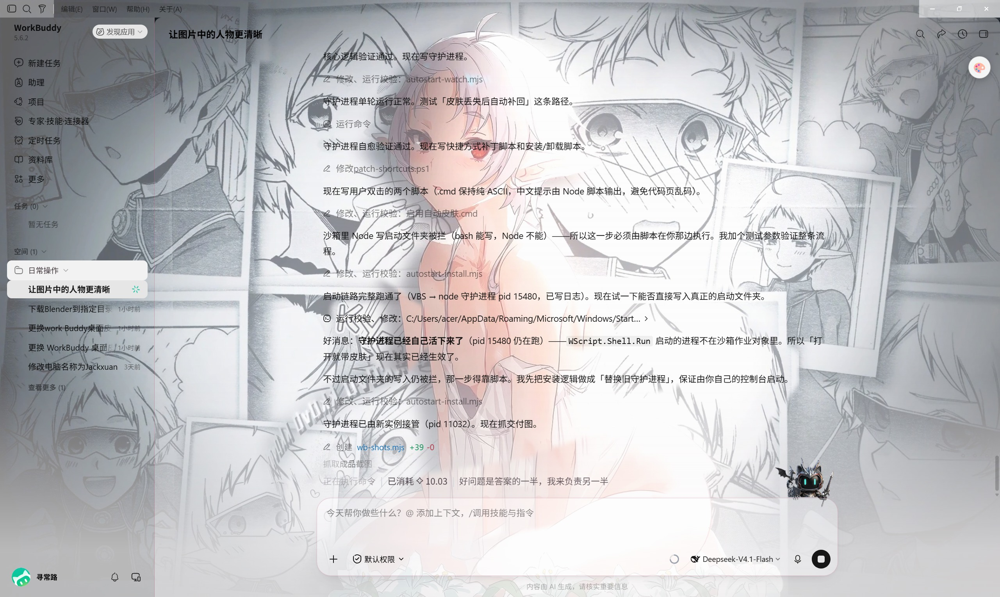
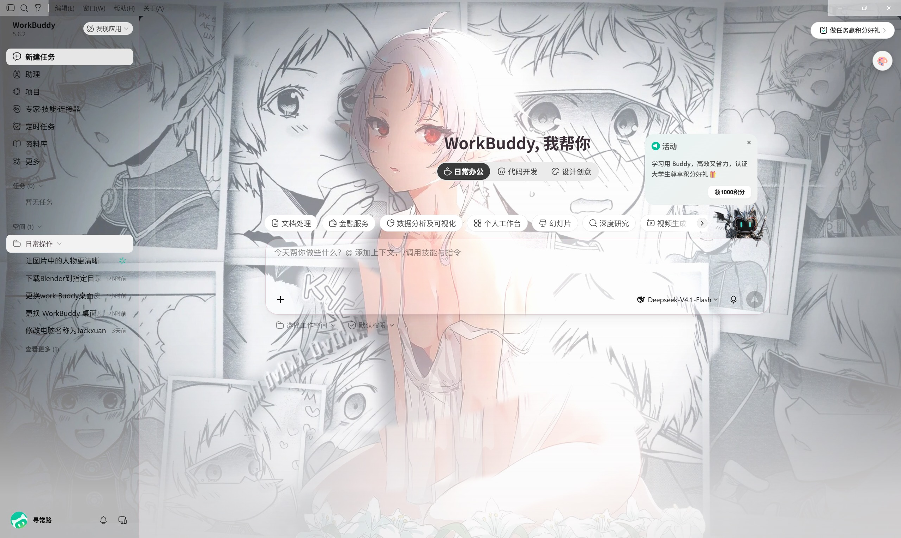
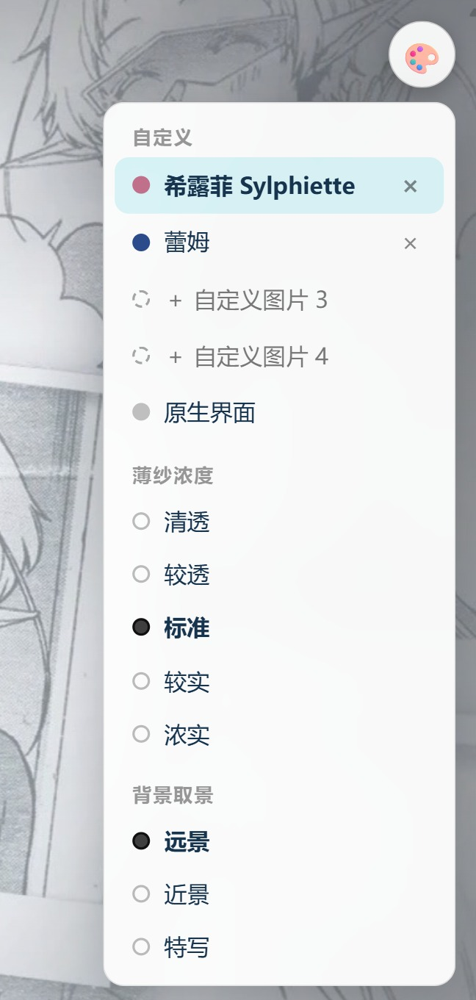

# WorkBuddy「希露菲」皮肤定制

把《无职转生》希露菲叶特立绘做成 WorkBuddy 桌面皮肤：主界面、侧边栏、顶部菜单栏、输入框、「新建任务」首页全部透出底图，并支持自定义槽位与「打开即带皮肤」。

> 引擎、主题、一键脚本全部随仓库分发。clone 下来按「安装与使用」三步即可在自己电脑上跑起来，零 npm 依赖。

> 完成时间：2026-10-02　|　环境：WorkBuddy 5.6.2 / Windows　|　主题 ID：`sylphiette-91f4818e`

## 最终效果

**主界面** —— 侧边栏、输入框、右侧面板均透出底图线稿



**「新建任务」首页** —— 独立路由视图也做了透明化



**皮肤菜单（🎨）** —— 分为「自定义 / 薄纱浓度 / 背景取景」三组



**底图（增强版）**


## 关键改造点

### 底图增强

原图偏灰偏淡，直接当背景会呈现「白雾感」。用色阶拉伸 0.88 + 对比度 1.13 + 饱和度 1.28 + S 曲线 0.24 处理，人物与裙褶线稿明显更清晰。调薄纱和增强底图必须配套做——底图本身太淡时，单靠降低薄纱只会得到一片白雾。

### 穿透 5.6.2 的多层白底

WorkBuddy 5.6.2 起新增了多个铺满全屏的不透明白底层，包括网格滚动容器、「新建任务」首页路由视图、会话外壳、详情面板等。不把它们逐一透明化，就会出现「注入成功但界面毫无变化」的现象。定位方法是按目标区域坐标遍历元素，筛选出不透明背景、有边框或阴影的层。

### 顶部 30px 菜单栏

主根容器从 y=30 才开始，所以顶部菜单栏区域必须把底图同时挂到 body 上，否则那一条永远是白的。

### 输入框的关键坑

输入框原先使用模糊背景，即使背景设成完全透明，看上去仍是实心白卡片——因为底图仅有的一点线稿被高斯模糊糊成了纯白。改用饱和度与对比度提升、去掉模糊后，裙褶和纸张分界线立刻透了出来。**底图偏淡时优先加饱和对比，不要用大模糊。**

### 薄纱浓度 / 背景取景

薄纱 5 档、取景 3 档，都是运行时纯 CSS 切换，走独立的覆盖样式表，不重新注入。底图只存一份在自定义属性里，取景通过尺寸变量实现——若把底图写进每个预设，多份 base64 会撑爆注入通道。

### 自定义槽位

共 4 格，每格按「上传的图片 → 第 N 个已装皮肤 → 空槽」三态解析。对已装皮肤点 × 不是删除而是隐藏，菜单里会出现「恢复被隐藏的皮肤」。激活状态被记住，重开也能还原用户的选择。

### 打开即带皮肤

由一个常驻守护进程完成：检测到皮肤丢失就重新注入（渲染进程刷新后可自愈）；WorkBuddy 没带调试端口在跑时，宽限一段时间后带端口重启一次。守护进程启动时如果 WorkBuddy 已在运行，绝不会打断当前会话。

## 最终透明度定稿

- 顶部菜单栏：34%
- 侧边栏：38%
- 主内容区：34% → 60% 渐变底衬
- 详情面板：82%（磨砂）
- 输入框：36%（唯一保留的薄纱白层）
- 正文文字：主 100% / 次 90% / 禁用 76%

调整经验：一次只能小步走（±5~8%）。曾一次性下调 20%，视觉效果直接变成「全透白」，只能回退重来。

## 安装与使用

前置条件：Windows + 已安装 WorkBuddy；Node 18+（WorkBuddy 自带的 Node 即可，没有就装一个系统 Node）。

1. **获取本仓库**：网页绿色 Code 按钮 → Download ZIP，或

   ```bash
   git clone https://github.com/hgfmy/workbuddy-sylphiette-skin.git
   ```

2. **安装引擎**：把 `engine/` 整个文件夹复制到：

   ```
   %USERPROFILE%\.workbuddy\skills\workbuddy-skin-studio
   ```

   复制完成后，该目录下应能直接看到 `src`、`scripts`、`themes`、`package.json`。希露菲主题随 `engine/themes/` 一起装好，不需要单独操作。

3. **配置一键脚本**：`scripts/` 下的 4 个 `.cmd` 顶部各有一个变量块，按你的环境核对：

   - `NODE` —— WorkBuddy 内置 node.exe（形如 `%USERPROFILE%\.workbuddy\binaries\node\versions\<版本号>\node.exe`，版本号以你机器实际为准）
   - `ROOT` —— 第 2 步的安装目录
   - `EXE` —— WorkBuddy 主程序路径（仅还原脚本用到）

4. **应用皮肤**：双击 `scripts/apply-skin.cmd`，WorkBuddy 会以调试模式重启并注入皮肤（约 20-40 秒）。想要「以后每次打开自动带皮肤」，双击 `scripts/enable-auto-skin.cmd` 装一次常驻守护进程即可。

5. **日常调整**：点 WorkBuddy 右上角 🎨，可换自定义图片、调薄纱浓度、调背景取景；想回到官方外观用 `scripts/revert-skin.cmd`。

## 踩坑记录

- **注入成功但界面不变**：几乎都是新增的不透明白底层在遮挡，需要重新定位并透明化。
- **调输入框透明度无反应**：元凶是模糊滤镜把淡色线稿糊成了纯白，不是透明度的锅。
- **输入框能看到的底图有限**：输入框固定在视口底部，底图铺满视口时，它永远只能露出图片最底部那一小条。想让那一带有内容，只能换图或重新拼一张底图。
- **菜单出现重复条目**：旧主题行未清理干净，需要定位后删除重复渲染。
- **沙箱限制**：环境内无法直接杀掉并重启 WorkBuddy（会连带终止自身进程），因此「启用自动皮肤」这一步必须由用户手动双击脚本完成。

## 交付物

- `engine/` —— 完整可运行的皮肤引擎：CDP 注入、薄纱/取景预设、主题管理、常驻守护进程，零 npm 依赖（Node 18+ 原生模块）
- `engine/themes/sylphiette-91f4818e/` —— 希露菲主题（theme.json + 增强底图），随引擎一起安装
- `images/` —— 4 张效果图素材
- `scripts/` —— 4 个一键脚本（Windows .cmd）
- 本说明文档

### 脚本对照

| 文件 | 对应中文名 | 作用 |
| --- | --- | --- |
| `scripts/enable-auto-skin.cmd` | 启用自动皮肤 | 装一次，之后打开 WorkBuddy 自动带皮肤 |
| `scripts/disable-auto-skin.cmd` | 停用自动皮肤 | 彻底关闭自动皮肤 |
| `scripts/apply-skin.cmd` | 一键换肤 | 重启 WorkBuddy 并注入皮肤 |
| `scripts/revert-skin.cmd` | 一键还原 | 还原官方外观 |

脚本依赖 `workbuddy-skin-studio` 技能与 WorkBuddy 内置的 Node 运行时，路径已用 `%USERPROFILE%` 变量表示，不含任何个人目录信息。若你的 Node 版本号或 WorkBuddy 安装位置不同，改脚本顶部对应的两三个变量即可：

- `NODE` —— WorkBuddy 内置 node.exe
- `ROOT` —— skin studio 技能目录
- `EXE` —— WorkBuddy 主程序（仅还原脚本用到）

`enable-auto-skin.cmd` 需要由你手动双击执行一次：它会先结束并重启 WorkBuddy 以便带调试端口启动，这个动作无法由脚本外部代劳。

---

**作者**：怀古风名月

